# 🫀 Heart Health Detection System

A deep learning-based system for detecting heart disease risk through retinal image analysis using Convolutional Neural Networks (CNN).

## 📋 Table of Contents
- [Overview](#-overview)
- [Features](#-features)
- [Technology Stack](#-technology-stack)
- [Project Structure](#-project-structure)
- [Installation](#-installation)
- [Usage](#-usage)
- [Program Flow](#-program-flow)
- [Model Architecture](#-model-architecture)
- [Results](#-results)
- [Contributing](#-contributing)
- [License](#-license)

## 🔍 Overview

This project implements a machine learning solution for early detection of heart disease risk by analyzing retinal images. The system uses a Convolutional Neural Network (CNN) to classify retinal scans into two categories: **Healthy** and **Disease Risk**.

## ✨ Features

- 🖼️ **Image Preprocessing**: Automated image resizing and normalization
- 🧠 **Deep Learning Model**: Custom CNN architecture with multiple convolutional layers
- 📊 **Performance Metrics**: Comprehensive evaluation with confusion matrix and classification reports
- 💾 **Model Persistence**: Save and load trained models for future predictions
- 🎯 **High Accuracy**: Achieves ~80% accuracy on test data
- ⚡ **Real-time Prediction**: Fast inference on new retinal images

## 🛠️ Technology Stack

| Technology | Purpose |
|------------|---------|
|  | Core Programming Language |
|  | Deep Learning Framework |
|  | Neural Network API |
|  | Image Processing |
|  | Numerical Computing |
|  | Machine Learning Utilities |

## 📁 Project Structure

```
HeartHealthDetection/
│
├── 1000images/                 # Dataset directory
│   ├── DiseaseRisk/           # Images with disease indicators
│   └── Healthy/               # Healthy retinal images
│
├── shri.ipynb                 # Main Jupyter notebook
├── model.h5                   # Trained model file
└── README.md                  # Project documentation
```

## 📥 Installation

### Prerequisites
- Python 3.12 or higher
- pip package manager

### Setup Steps

1. **Clone the repository**
```bash
git clone <repository-url>
cd HeartHealthDetection
```

2. **Install required packages**
```bash
pip install tensorflow opencv-python numpy scikit-learn jupyter
```

3. **Verify installation**
```bash
python -c "import tensorflow as tf; print(tf.__version__)"
```

## 🚀 Usage

### Training the Model

1. Open the Jupyter notebook:
```bash
jupyter notebook shri.ipynb
```

2. Run all cells to train the model on the dataset

3. The trained model will be saved as `model.h5`

### Making Predictions

```python
import cv2
import numpy as np
from tensorflow.keras.models import load_model

# Load the trained model
model = load_model('model.h5')

# Preprocess and predict
def predict_image(image_path):
    img = cv2.imread(image_path)
    img = cv2.resize(img, (128, 128))
    img = img / 255.0
    img = np.expand_dims(img, axis=0)
    
    prediction = model.predict(img)
    predicted_class = np.argmax(prediction)
    categories = ['Healthy', 'DiseaseRisk']
    
    print(f"Predicted Class: {categories[predicted_class]}")
    print(f"Confidence: {prediction[0][predicted_class] * 100:.2f}%")

# Example usage
predict_image("path/to/retinal/image.jpg")
```

## 🔄 Program Flow

```mermaid
graph TD
    A[📂 Load Dataset] --> B[🖼️ Image Preprocessing]
    B --> C[📏 Resize to 128x128]
    C --> D[🔢 Normalize Pixels 0-1]
    D --> E[✂️ Train-Test Split 80-20]
    E --> F[🔄 One-Hot Encoding]
    F --> G[🏗️ Build CNN Model]
    G --> H[⚙️ Compile Model]
    H --> I[🎓 Train Model 50 Epochs]
    I --> J[📊 Evaluate Performance]
    J --> K[💾 Save Model]
    K --> L[🎯 Make Predictions]
```



### Detailed Workflow

#### 1️⃣ **Data Loading & Preprocessing**
```
Input: Raw retinal images (JPG format)
↓
Process: Load images from Healthy and DiseaseRisk folders
↓
Output: Preprocessed image arrays
```

#### 2️⃣ **Image Transformation**
```
Resize: 128 x 128 pixels
Normalize: Pixel values [0, 1]
Format: RGB color channels
```

#### 3️⃣ **Data Splitting**
```
Training Set: 80% (369 images)
Validation Set: 16% (74 images)
Test Set: 20% (93 images)
```

#### 4️⃣ **Model Training**
```
Architecture: CNN with 3 Conv layers
Optimizer: Adam (lr=0.001)
Loss Function: Categorical Crossentropy
Epochs: 50
Batch Size: 50
```

#### 5️⃣ **Evaluation & Prediction**
```
Metrics: Accuracy, Precision, Recall, F1-Score
Visualization: Confusion Matrix
Output: Class prediction with confidence score
```

## 🏗️ Model Architecture

```
┌─────────────────────────────────────┐
│  Input Layer (128x128x3)            │
└──────────────┬──────────────────────┘
               │
┌──────────────▼──────────────────────┐
│  Conv2D (32 filters, 3x3)           │
│  Activation: ReLU                   │
└──────────────┬──────────────────────┘
               │
┌──────────────▼──────────────────────┐
│  MaxPooling2D (2x2)                 │
└──────────────┬──────────────────────┘
               │
┌──────────────▼──────────────────────┐
│  Conv2D (64 filters, 3x3)           │
│  Activation: ReLU                   │
└──────────────┬──────────────────────┘
               │
┌──────────────▼──────────────────────┐
│  MaxPooling2D (2x2)                 │
└──────────────┬──────────────────────┘
               │
┌──────────────▼──────────────────────┐
│  Conv2D (128 filters, 3x3)          │
│  Activation: ReLU                   │
└──────────────┬──────────────────────┘
               │
┌──────────────▼──────────────────────┐
│  MaxPooling2D (2x2)                 │
└──────────────┬──────────────────────┘
               │
┌──────────────▼──────────────────────┐
│  Flatten Layer                      │
└──────────────┬──────────────────────┘
               │
┌──────────────▼──────────────────────┐
│  Dense (128 units, ReLU)            │
└──────────────┬──────────────────────┘
               │
┌──────────────▼──────────────────────┐
│  Dropout (0.5)                      │
└──────────────┬──────────────────────┘
               │
┌──────────────▼──────────────────────┐
│  Output Layer (2 units, Softmax)    │
│  Classes: [Healthy, DiseaseRisk]    │
└─────────────────────────────────────┘
```

### Layer Details

| Layer Type | Output Shape | Parameters | Activation |
|------------|--------------|------------|------------|
| Conv2D | (126, 126, 32) | 896 | ReLU |
| MaxPooling2D | (63, 63, 32) | 0 | - |
| Conv2D | (61, 61, 64) | 18,496 | ReLU |
| MaxPooling2D | (30, 30, 64) | 0 | - |
| Conv2D | (28, 28, 128) | 73,856 | ReLU |
| MaxPooling2D | (14, 14, 128) | 0 | - |
| Flatten | (25,088) | 0 | - |
| Dense | (128) | 3,211,392 | ReLU |
| Dropout | (128) | 0 | - |
| Dense | (2) | 258 | Softmax |

**Total Parameters**: ~3.3M

## 📈 Results

### Performance Metrics

```
Overall Accuracy: 80.65%

Classification Report:
┌─────────────┬───────────┬────────┬──────────┬─────────┐
│   Class     │ Precision │ Recall │ F1-Score │ Support │
├─────────────┼───────────┼────────┼──────────┼─────────┤
│  Healthy    │   0.72    │  0.50  │   0.59   │   26    │
│ DiseaseRisk │   0.83    │  0.93  │   0.87   │   67    │
└─────────────┴───────────┴────────┴──────────┴─────────┘
```

### Confusion Matrix

```
                Predicted
              Healthy  DiseaseRisk
Actual  
Healthy        13         13
DiseaseRisk     5         62
```

### Key Insights

✅ **Strengths**:
- High recall (93%) for Disease Risk detection
- Good precision (83%) for Disease Risk class
- Effective at identifying at-risk patients

⚠️ **Areas for Improvement**:
- Improve Healthy class recall (currently 50%)
- Reduce false positives for Healthy class
- Consider data augmentation for better balance

## 🤝 Contributing

Contributions are welcome! Please follow these steps:

1. Fork the repository
2. Create a feature branch (`git checkout -b feature/AmazingFeature`)
3. Commit your changes (`git commit -m 'Add some AmazingFeature'`)
4. Push to the branch (`git push origin feature/AmazingFeature`)
5. Open a Pull Request

## 📄 License

This project is licensed under the MIT License - see the LICENSE file for details.

## 👥 Authors

- **Shri** - *Initial work*

## 🙏 Acknowledgments

- Dataset source: Retinal image database
- TensorFlow and Keras communities
- OpenCV contributors

## 📞 Contact

For questions or feedback, please open an issue in the repository.

---

<div align="center">
  <p>Made with ❤️ for early heart disease detection</p>
  <p>⭐ Star this repository if you find it helpful!</p>
</div>
